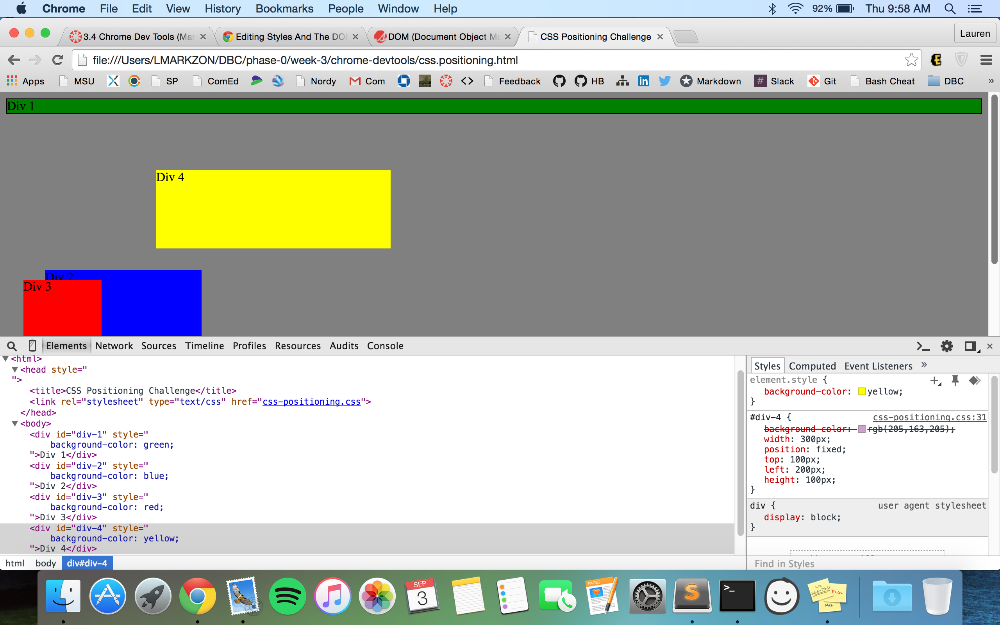
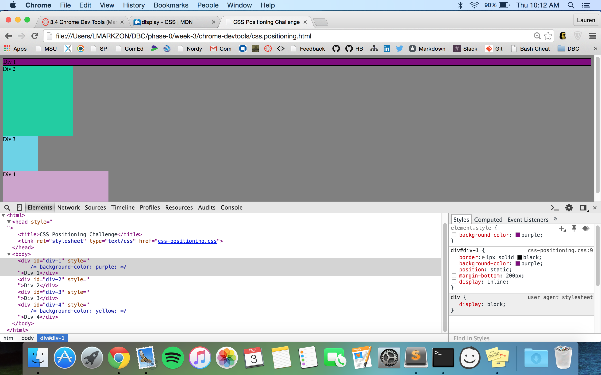
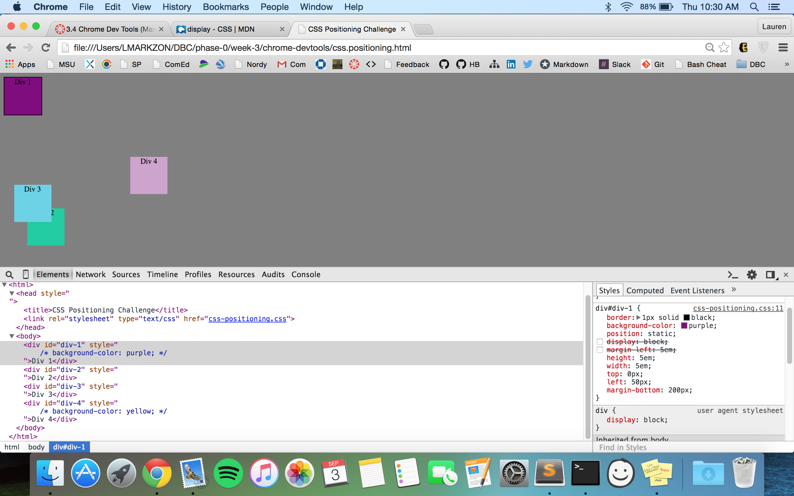
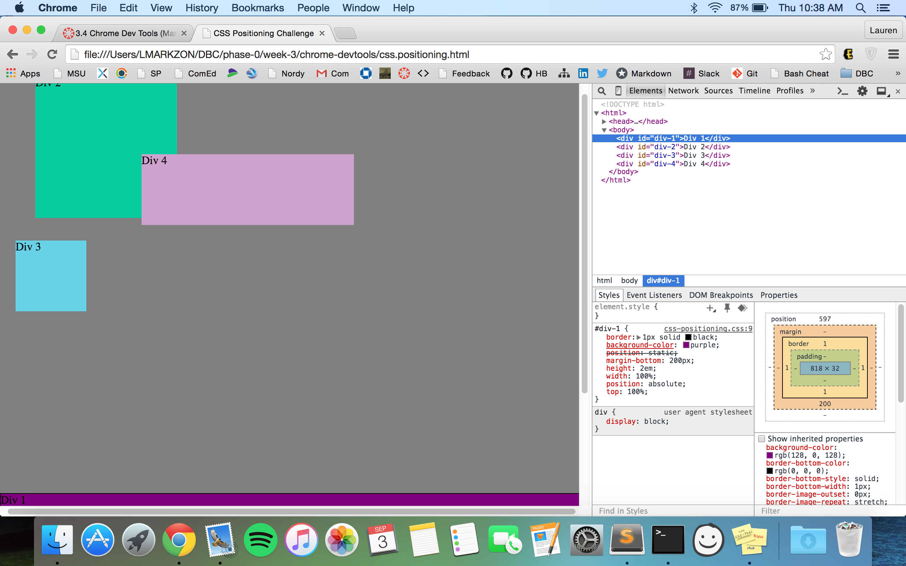
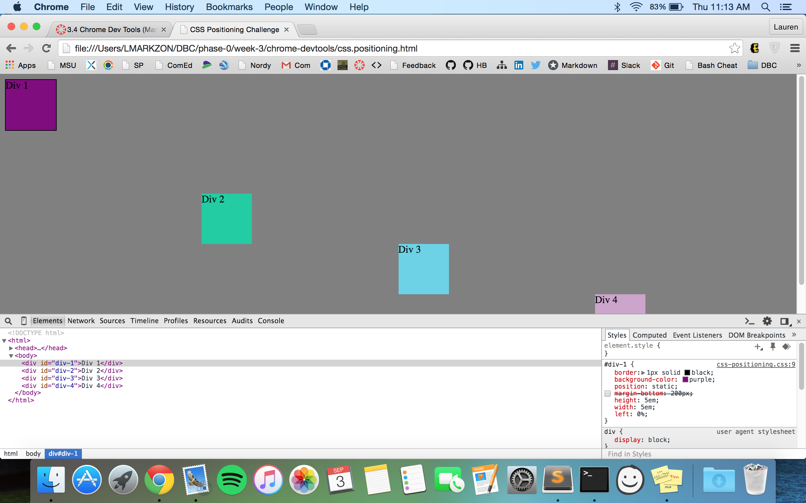

Reflection:
- How can you use Chrome's DevTools inspector to help you format or position elements?
	There are a few different ways Chrome's Devtools inspector helps you format/position elements, one is that it lists (in a very organized fashion) all of the CSS elements that went into webpage, colors, sizes, etc. The biggest for me was that it allows you to experiment and play with the different elements since you can immediately see the results on your screen, then you decide what you want to keep or change. It also lets you know what "item" you are editing by highlighting it on the website when you hover your mouse over it in the inspector, which was very helpful for me. 

- How can you resize elements on the DOM using CSS?
	In my pair we resized the different colored boxes by changing the height and the width of each one. When we were asked to make a square, we just made the height and the width the same numbers, since a square has equal sides. I'm not sure if there are other ways to do this, but that was the easiest and most logical way for us.

- What are the differences between Absolute, Fixed, Static, and Relative positioning? Which did you find easiest to use? Which was most difficult?
	Absolute is when the position of the element is literally exactly where you want it to be when placed, so it doesn't move regardless of what's surrounding it.Fixed is positioned relative to the browser window itself, so even the window is scrolled the position doesn't change. Static means that the elements are not positioned in any special way, it is always positioned according to the normal flow of the page. It is the default position. Relative positioning means the element is relative to its normal self, meaning when you set the top, right, bottom, and left properties it will cause it to be adjusted away from its normal position. I didn't really find any of them "most difficult", but if I had to say which one seems the most confusing based on what I know - I would say relative is most difficult and absolute or static is the easiest.

- What are the differences between Margin, Border, and Padding?
	The margin is transparent and clears an area outside of the border, it is the "outside" of the box model. The next "layer" is the border, which is between the margin and the padding, and can be seen on the page. Lastly, after the margin and border is the padding, which clears an area around the content of the site, and is also transparent.

- What was your impression of this challenge overall? (love, hate, and why?)
	Understanding the initial goal of the challenge and what we were supposed to be focusing on was confusing for me, which made it a bit more tedious than it needed to be. We would spend a certain amount of time on one aspect of the challenge, and then when we reached the end we realized that it wasn't important at all and that we wasted time. Besides that, it was pretty cool and exciting once we edited the inspector correctly and saw the results we were looking for on the page.

1. Change Color

2. Make 2 Columns

3. Rows

4. Make Equidistant

5. Sqaures

6. Footer

7. Header

8. Sidebar

9. Get Creative
