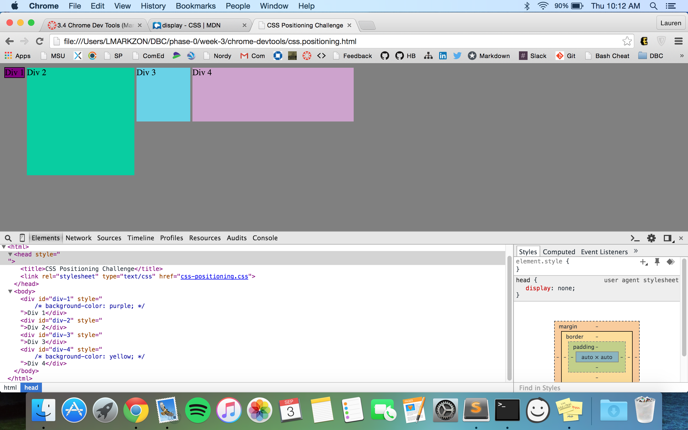
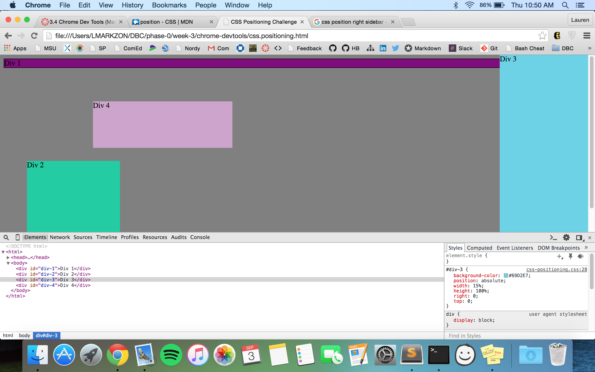

Reflection:
- How can you use Chrome's DevTools inspector to help you format or position elements?
	There are a few different ways Chrome's Devtools inspector helps you format/position elements, one is that it lists (in a very organized fashion) all of the CSS elements that went into webpage, colors, sizes, etc. The biggest for me was that it allows you to experiment and play with the different elements since you can immediately see the results on your screen, then you decide what you want to keep or change. It also lets you know what "item" you are editing by highlighting it on the website when you hover your mouse over it in the inspector, which was very helpful for me. 

- How can you resize elements on the DOM using CSS?
	In my pair we resized the different colored boxes by changing the height and the width of each one. When we were asked to make a square, we just made the height and the width the same numbers, since a square has equal sides. I'm not sure if there are other ways to do this, but that was the easiest and most logical way for us.

- What are the differences between Absolute, Fixed, Static, and Relative positioning? Which did you find easiest to use? Which was most difficult?
	Absolute: 
	Fixed: 
	Static: 
	Relative: 

- What are the differences between Margin, Border, and Padding?

- What was your impression of this challenge overall? (love, hate, and why?)

1. Change Color

2. Make 2 Columns

3. Rows

4. Make Equidistant

5. Sqaures

6. Footer

7. Header

8. Sidebar

9. Get Creative
