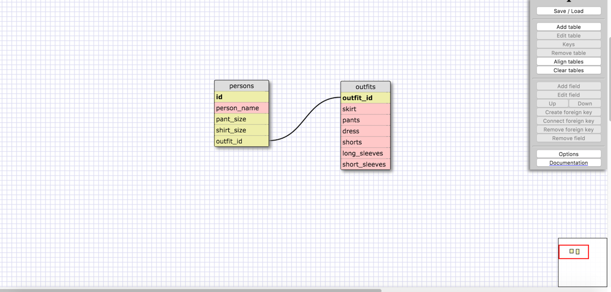

####Release 5: SELECTing data from a database    
1. Select all data for all states. 
	SELECT * FROM states;
2. Select all data for all regions.  
	SELECT * FROM regions;
3. Select the state_name and population for all states.    
	SELECT state_name, population FROM states;
4. Select the state_name and population for all states ordered by population. The state with the highest population should be at the top.    
	SELECT state_name, population FROM states ORDER BY population DESC;
5. Select the state_name for the states in region 7.    
	SELECT state_name FROM states WHERE region_id=7;
6. Select the state_name and population_density for states with a population density over 50 ordered from least to most dense.    
	SELECT state_name, population_density FROM states WHERE population_density > 50 ORDER BY population_density ASC;
7. Select the state_name for states with a population between 1 million and 1.5 million people.     
	SELECT state_name FROM states WHERE population > 1000000 AND population < 1500000;
8. Select the state_name and region_id for states ordered by region in ascending order.    
	SELECT state_name, region_id FROM states ORDER BY region_id ASC;
9. Select the region_name for the regions with "Central" in the name.    
	SELECT region_name FROM regions WHERE region_name LIKE '%Central%';
10. Select the region_name and the state_name for all states and regions in ascending order by region_id. Refer to the region by name. (This will involve joining the tables).    
	SELECT region_name, state_name FROM states INNER JOIN regions ON states.region_id=regions.id ORDER BY region_id ASC;

####Release 6: Your Own Schema

####Release 7: Reflect
- What are databases for?    
	Databases are used to store to data in a structured way so that it can be easily searched and accessed in the future. They are composed of entities, attributes, and the relationships between them, which is represented in the form of tables with columns and rows. 
- What is a one-to-many relationship?    
	A one-to-many relationship is when the value of an attribute could be multiple many values, such as ONE person owning MANY cars. Each person can have 0, 1, or multiple cars, but each car can only have 1 owner. So you use primary and foreign keys to define the relationships between the entities. A one-to-many relationship can be identified using the phrases "____ belongs to a ____. ____ has many ____."
- What is a primary key? What is a foreign key? How can you determine which is which?    
	A primary key uniquely identifies each record/row, allowing you to identify each and every entity separately. It must be unique to every instance of that entity, every entity instance must have one, and no duplicate names (cannot be shared with more than one entity instance). A foreign key's values are primary keys, so it's an attribute that refers to a primary key of another entity. These are used to help represent the relationship between attributes in the tables. Duplicates are allowed and neccessary in foreign keys, since, for example, one person could own several cars. 
- How can you select information out of a SQL database? What are some general guidelines for that?    
	You use the SQL command SELECT and if you want to select all of the information you can use the wildcard * with it, followed by FROM the table name you are working with. If you want to select more specific information, such as certain columns, you can write SELECT followed by the column_name followed by FROM and the table name. If you want to select all the data from more than one table you just separate the table_names with a comma. Also, all commands should be in all capital letters and can be listed in a single statement following each other, ending each line/statement with a semi-colon.