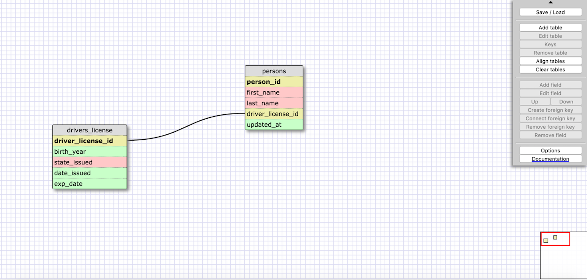
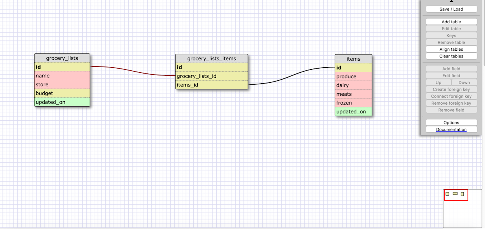

####Release 2: One-to-one Schema       
In a One-to-One relationship, you have two tables of attributes that have some relationship, but that relationship only exists in a way that any given row from Table A can have at most one matching row in Table B. It's when two things have a single relationship to one another, they are a pair. So in this case, one person is related to only one Drivers License, and any individual Drivers License can point back to only one particular person(in this particular case/country). This goes the same for the persons address, each address belongs to only one person and each person only has one address(again, in this particular case, of course in real life people can own more than one home and therefore have more than one address).

####Release 4: Refactor           

####Release 6: Reflect
- What is a one-to-one database?     
	In a One-to-One relationship, you have two tables of attributes that have some relationship, but that relationship only exists in a way that any given row from Table A can have at most one matching row in Table B. It's when two things have a single relationship to one another, they are a pair and link only directly to each other.
- When would you use a one-to-one database? (Think generally, not in terms of the example you created).     
	As far as I can understand, whenever you have two tables that have the same primary key and are joined by a foreign key, a one-to-one relationship exists. Meaning, if there is a "parent table" and a "child table" that kind of need each other for the other to exist. Going back to the Drivers license example, you can have a person without a license, but you can't have a license without a person (it can't exist on its own), it just wouldn't make sense.
- What is a many-to-many database?   
	This is when you need to use multiple instances on both sides of the relationship. This relationship can be described using a join table, that combines the information about the relationships between 2 tables into an additional 3rd "join table". The fields in the join table are foreign keys, which are the primary keys of the other 2 tables in which you are showing/representing the relationships.
- When would you use a many-to-many database? (Think generally, not in terms of the example you created).     
	You would use a many-to-many database if you're in a situation where the rows in table-A can map to multiple instances(rows) in table-B, and even those rows in table-B can map to multiple (and different) rows in table-A. 
- What is confusing about database schemas? What makes sense?     
	Comparing database schemas to just normal table columns/rows is really helpful in my personal understanding of sql databases. The only thing at this point that I'm a little confused about every so often is when to use one-to-one database schemas, but it's starting to make more sense the more I play around with the schema designer.